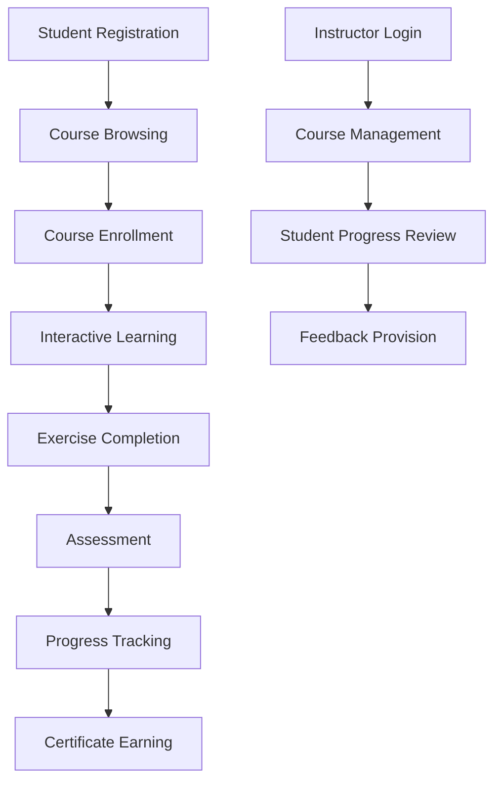

## 1. Product Overview
基于Python的数据分析在线教育平台，专为商务数据分析与应用专业学生设计，提供完整的课程体系、互动式学习模块和成就激励系统。
- 解决商务数据分析专业学生缺乏系统化、实践导向的在线学习平台的问题，帮助学生掌握Python数据分析技能。
- 目标市场为高等教育机构的商务数据分析专业，提供实践导向的在线学习体验。

## 2. Core Features

### 2.1 User Roles
| Role | Registration Method | Core Permissions |
|------|---------------------|------------------|
| Student | Email registration | Access courses, complete exercises, take assessments, track progress |
| Instructor | Admin invitation | Manage courses, create exercises, grade assessments, monitor student progress |

### 2.2 Feature Module
1. **Home page**: Hero section, course categories, featured courses, navigation
2. **Course page**: Course details, curriculum, learning materials
3. **Learning module**: Interactive coding environment, exercises, assessments
4. **Progress dashboard**: Learning progress, achievements, skill metrics
5. **Profile page**: User information, course history, certifications

### 2.3 Page Details
| Page Name | Module Name | Feature description |
|-----------|-------------|---------------------|
| Home page | Hero section | Introduction to platform, key features highlight, call-to-action |
| Home page | Course categories | Browse courses by topics (Python basics, data visualization, machine learning) |
| Home page | Featured courses | Display popular or recommended courses |
| Course page | Course details | Course description, instructor info, prerequisites, duration |
| Course page | Curriculum | Module breakdown, lesson list, learning objectives |
| Course page | Learning materials | Videos, slides, reading materials |
| Learning module | Interactive coding environment | In-browser Python editor with real-time execution |
| Learning module | Exercises | Practice problems with automated grading |
| Learning module | Assessments | Quizzes and projects to test knowledge |
| Progress dashboard | Learning progress | Track completion of courses and modules |
| Progress dashboard | Achievements | Badges and certificates earned |
| Progress dashboard | Skill metrics | Visualization of skill development over time |
| Profile page | User information | Personal details, account settings |
| Profile page | Course history | List of completed and in-progress courses |
| Profile page | Certifications | Downloadable certificates for completed courses |

## 3. Core Process
**Student Flow:**
1. Student registers and logs in to the platform
2. Browses courses and selects one to enroll
3. Accesses learning materials and completes interactive exercises
4. Takes assessments to test understanding
5. Tracks progress and earns achievements
6. Receives certificates upon course completion

**Instructor Flow:**
1. Instructor logs in to the platform
2. Creates and manages courses and learning materials
3. Reviews student progress and grades assessments
4. Provides feedback and support to students

## 4. User Interface Design
### 4.1 Design Style
- Primary colors: Blue (#165DFF) and orange (#FF7D00) - representing trust and energy
- Secondary colors: Light gray (#F5F7FA) for backgrounds, dark gray (#333333) for text
- Button style: Rounded corners (8px), subtle shadow effects
- Font: Inter for body text, Montserrat for headings
- Layout style: Card-based design with clear hierarchy, top navigation bar
- Icon style: Modern, minimalistic line icons

### 4.2 Page Design Overview
| Page Name | Module Name | UI Elements |
|-----------|-------------|-------------|
| Home page | Hero section | Full-width banner with gradient background, bold headline, call-to-action button, subtle animation |
| Home page | Course categories | Grid of category cards with icons, hover effects |
| Home page | Featured courses | Carousel of course cards with images, ratings, and enrollment numbers |
| Course page | Course details | Hero section with course image, title, instructor info, enrollment button |
| Course page | Curriculum | Expandable modules with lesson lists, progress indicators |
| Learning module | Interactive coding environment | Split-screen layout with code editor and output panel, syntax highlighting, run button |
| Learning module | Exercises | Question cards with code input fields, submit button, hints system |
| Progress dashboard | Learning progress | Visual progress bars, completion percentages, timeline view |
| Progress dashboard | Achievements | Grid of badge icons with unlock status, hover tooltips |
| Profile page | User information | Clean form layout, profile picture upload, account settings sections |

### 4.3 Responsiveness
- Desktop-first design with mobile-adaptive layout
- Breakpoints: 1200px (desktop), 768px (tablet), 480px (mobile)
- Touch optimization for mobile devices
- Collapsible navigation menu on mobile

### 4.4 3D Scene Guidance (Not Applicable)
- This project does not require 3D scenes