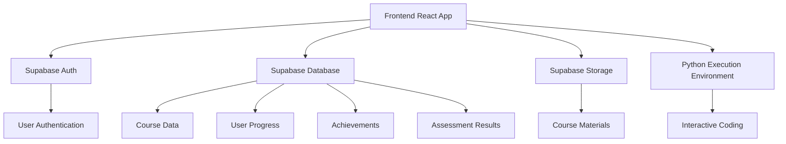
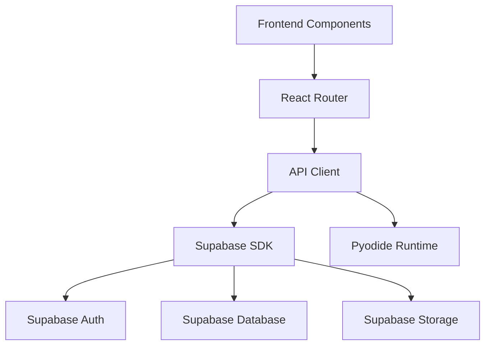
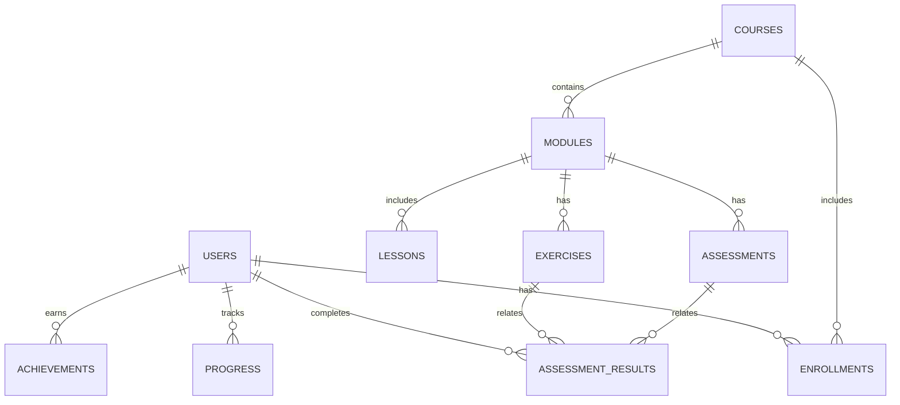

## 1. Architecture Design


## 2. Technology Description
- Frontend: React@18 + TypeScript + Tailwind CSS@3 + Vite
- Initialization Tool: Vite-init
- Backend: Supabase (Authentication, Database, Storage)
- Database: Supabase (PostgreSQL)
- Python Execution: Pyodide (in-browser Python runtime)
- Deployment: Cloudflare Pages

## 3. Route Definitions
| Route | Purpose |
|-------|---------|
| / | Home page with featured courses and categories |
| /courses | List of all courses |
| /courses/:id | Course details page |
| /learn/:courseId/:moduleId | Interactive learning module |
| /dashboard | User progress dashboard |
| /profile | User profile page |
| /login | Login page |
| /register | Registration page |
| /instructor | Instructor dashboard |
| /instructor/courses | Manage courses |
| /instructor/students | Monitor student progress |

## 4. API Definitions
### 4.1 Authentication
- **Login**: POST /auth/login (email, password) → JWT token
- **Register**: POST /auth/register (email, password, name) → JWT token
- **Logout**: POST /auth/logout → Success message

### 4.2 Course Management
- **Get Courses**: GET /api/courses → List of courses
- **Get Course Details**: GET /api/courses/:id → Course details
- **Enroll Course**: POST /api/courses/:id/enroll → Success message

### 4.3 Learning Progress
- **Get Progress**: GET /api/progress → User progress data
- **Update Progress**: POST /api/progress → Updated progress
- **Submit Exercise**: POST /api/exercises/:id/submit → Grading result
- **Submit Assessment**: POST /api/assessments/:id/submit → Grading result

### 4.4 Achievements
- **Get Achievements**: GET /api/achievements → User achievements
- **Award Achievement**: POST /api/achievements/award → New achievement

## 5. Server Architecture Diagram


## 6. Data Model
### 6.1 Data Model Definition


### 6.2 Data Definition Language
#### Users Table
```sql
CREATE TABLE users (
  id UUID PRIMARY KEY DEFAULT uuid_generate_v4(),
  email TEXT UNIQUE NOT NULL,
  password_hash TEXT NOT NULL,
  name TEXT NOT NULL,
  role TEXT DEFAULT 'student',
  created_at TIMESTAMP DEFAULT now(),
  updated_at TIMESTAMP DEFAULT now()
);

-- Grant permissions
GRANT SELECT ON users TO anon;
GRANT ALL PRIVILEGES ON users TO authenticated;
```

#### Courses Table
```sql
CREATE TABLE courses (
  id UUID PRIMARY KEY DEFAULT uuid_generate_v4(),
  title TEXT NOT NULL,
  description TEXT NOT NULL,
  instructor_id UUID REFERENCES users(id),
  category TEXT NOT NULL,
  level TEXT NOT NULL,
  duration TEXT NOT NULL,
  prerequisites TEXT,
  cover_image_url TEXT,
  created_at TIMESTAMP DEFAULT now(),
  updated_at TIMESTAMP DEFAULT now()
);

-- Grant permissions
GRANT SELECT ON courses TO anon;
GRANT ALL PRIVILEGES ON courses TO authenticated;
```

#### Modules Table
```sql
CREATE TABLE modules (
  id UUID PRIMARY KEY DEFAULT uuid_generate_v4(),
  course_id UUID REFERENCES courses(id),
  title TEXT NOT NULL,
  description TEXT,
  order_number INTEGER NOT NULL,
  created_at TIMESTAMP DEFAULT now(),
  updated_at TIMESTAMP DEFAULT now()
);

-- Grant permissions
GRANT SELECT ON modules TO anon;
GRANT ALL PRIVILEGES ON modules TO authenticated;
```

#### Lessons Table
```sql
CREATE TABLE lessons (
  id UUID PRIMARY KEY DEFAULT uuid_generate_v4(),
  module_id UUID REFERENCES modules(id),
  title TEXT NOT NULL,
  content TEXT NOT NULL,
  order_number INTEGER NOT NULL,
  video_url TEXT,
  created_at TIMESTAMP DEFAULT now(),
  updated_at TIMESTAMP DEFAULT now()
);

-- Grant permissions
GRANT SELECT ON lessons TO anon;
GRANT ALL PRIVILEGES ON lessons TO authenticated;
```

#### Exercises Table
```sql
CREATE TABLE exercises (
  id UUID PRIMARY KEY DEFAULT uuid_generate_v4(),
  module_id UUID REFERENCES modules(id),
  title TEXT NOT NULL,
  description TEXT NOT NULL,
  difficulty TEXT NOT NULL,
  solution TEXT NOT NULL,
  test_cases JSONB NOT NULL,
  created_at TIMESTAMP DEFAULT now(),
  updated_at TIMESTAMP DEFAULT now()
);

-- Grant permissions
GRANT SELECT ON exercises TO anon;
GRANT ALL PRIVILEGES ON exercises TO authenticated;
```

#### Assessments Table
```sql
CREATE TABLE assessments (
  id UUID PRIMARY KEY DEFAULT uuid_generate_v4(),
  module_id UUID REFERENCES modules(id),
  title TEXT NOT NULL,
  description TEXT NOT NULL,
  passing_score INTEGER NOT NULL,
  questions JSONB NOT NULL,
  created_at TIMESTAMP DEFAULT now(),
  updated_at TIMESTAMP DEFAULT now()
);

-- Grant permissions
GRANT SELECT ON assessments TO anon;
GRANT ALL PRIVILEGES ON assessments TO authenticated;
```

#### Enrollments Table
```sql
CREATE TABLE enrollments (
  id UUID PRIMARY KEY DEFAULT uuid_generate_v4(),
  user_id UUID REFERENCES users(id),
  course_id UUID REFERENCES courses(id),
  enrolled_at TIMESTAMP DEFAULT now(),
  completed_at TIMESTAMP
);

-- Grant permissions
GRANT SELECT ON enrollments TO anon;
GRANT ALL PRIVILEGES ON enrollments TO authenticated;
```

#### Progress Table
```sql
CREATE TABLE progress (
  id UUID PRIMARY KEY DEFAULT uuid_generate_v4(),
  user_id UUID REFERENCES users(id),
  lesson_id UUID REFERENCES lessons(id),
  completed BOOLEAN DEFAULT false,
  completed_at TIMESTAMP,
  created_at TIMESTAMP DEFAULT now(),
  updated_at TIMESTAMP DEFAULT now()
);

-- Grant permissions
GRANT SELECT ON progress TO anon;
GRANT ALL PRIVILEGES ON progress TO authenticated;
```

#### Assessment Results Table
```sql
CREATE TABLE assessment_results (
  id UUID PRIMARY KEY DEFAULT uuid_generate_v4(),
  user_id UUID REFERENCES users(id),
  assessment_id UUID REFERENCES assessments(id),
  score INTEGER NOT NULL,
  passed BOOLEAN NOT NULL,
  submitted_at TIMESTAMP DEFAULT now()
);

-- Grant permissions
GRANT SELECT ON assessment_results TO anon;
GRANT ALL PRIVILEGES ON assessment_results TO authenticated;
```

#### Achievements Table
```sql
CREATE TABLE achievements (
  id UUID PRIMARY KEY DEFAULT uuid_generate_v4(),
  user_id UUID REFERENCES users(id),
  name TEXT NOT NULL,
  description TEXT NOT NULL,
  badge_url TEXT NOT NULL,
  earned_at TIMESTAMP DEFAULT now()
);

-- Grant permissions
GRANT SELECT ON achievements TO anon;
GRANT ALL PRIVILEGES ON achievements TO authenticated;
```